# CheckMate_tryhackme
TryHackMe Operation Checkmate writeup documenting password attacks, targeted wordlist generation, OSINT-based password profiling, SHA-256 hash cracking, and SSH access using Hydra, CeWL, CUPP, and Hashcat.

# Operation Checkmate — TryHackMe Writeup

> **Room:** Operation Checkmate  
> **Platform:** TryHackMe  
> **Difficulty:** Easy  
> **Category:** Password Attacks / Web Security / Credential Attacks  
> **Status:** Completed

---

## Overview

**Operation Checkmate** is a hands-on TryHackMe challenge focused on identifying and exploiting weak password practices across multiple internal services.

The challenge simulates a security assessment of systems belonging to an employee named **Marco Bianchi**. Instead of relying on blind brute-force attacks, the room provides clues that can be used to build targeted password wordlists and understand the target's password-generation habits.

Throughout the assessment, I used techniques including:

- Service enumeration
- Default credential testing
- Online password attacks with **Hydra**
- Targeted wordlist generation with **CeWL**
- Password profiling with **CUPP**
- SHA-256 hash cracking with **Hashcat**
- SSH authentication
- OSINT-based password pattern analysis

> **Note:** This writeup intentionally does **not** reveal discovered passwords or the original filename from Level 4. The goal is to document the methodology while still requiring readers to perform the challenge themselves.

---

## Lab Information

| Information | Details |
|---|---|
| Platform | TryHackMe |
| Room | Operation Checkmate |
| Target | Marco Bianchi's internal services |
| Main Application | Port `5000` |
| FirewallOS | Port `5001` |
| Employee Portal | Port `5002` |
| Social Platform | Port `5003` |
| Final Access | SSH |
| Username | `marco` |

---

# Methodology

The overall attack chain was:

```text
                    ┌─────────────────────┐
                    │   Target Machine    │
                    │   10.49.x.x         │
                    └──────────┬──────────┘
                               │
              ┌────────────────┴────────────────┐
              │                                 │
        Port 5001                         Port 5002
        FirewallOS                    Employee Portal
              │                                 │
      Default Credentials                Company Keywords
              │                                 │
            Hydra                              │
              │                              CeWL
              │                                 │
              └──────────────┬──────────────────┘
                             │
                             ▼
                     Marco's Information
                             │
                             ▼
                       Port 5003
                     Social Platform
                             │
                    ┌────────┴────────┐
                    │                 │
                  CUPP          Password Pattern
                    │                 │
                    └────────┬────────┘
                             │
                             ▼
                    Targeted Credentials
                             │
                             ▼
                       SSH as marco
                             │
                             ▼
                       System Access
```

# Level 1 — Default Credentials

## Objective
The first clue revealed that Marco had deployed a firewall management interface on:
```
firewall.thm:5001
```
The clue also indicated that the firewall was using default credentials.
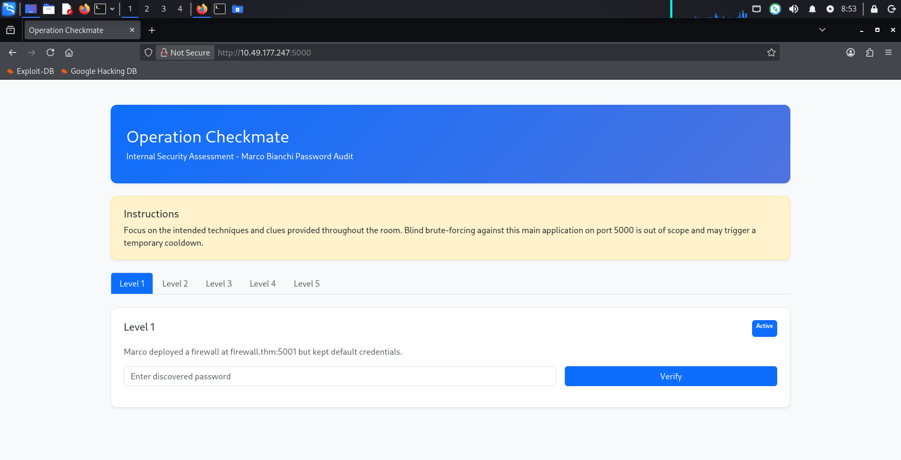

## Step 1 — Access the Firewall
I accessed the service on port 5001:
```
http://10.49.177.247:5001
```
The application presented a FirewallOS login page.

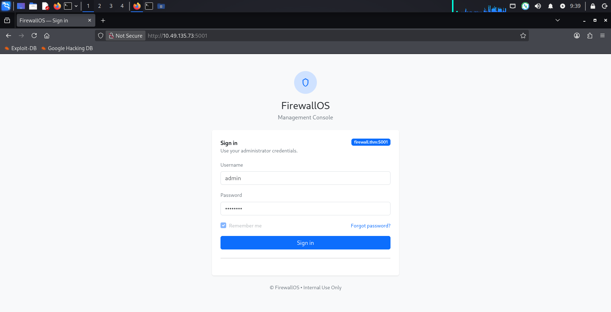

The username was identified as:
```
admin
```
## Step 2 — Password Attack with Hydra
Since the room specifically indicated that default credentials were being used, I performed a targeted online password attack against the login form.
```
hydra -l admin \
-P /usr/share/wordlists/rockyou.txt \
-s 5001 \
TARGET_IP \
http-post-form \
"/login:username=^USER^&password=^PASS^:F=Invalid credentials"
```
Explanation
- -l admin → specifies the username
- -P → uses the RockYou password list
- -s 5001 → targets port 5001
- http-post-form → attacks an HTTP POST login form
- F=Invalid credentials → tells Hydra what indicates a failed login
Hydra identified a valid credential.

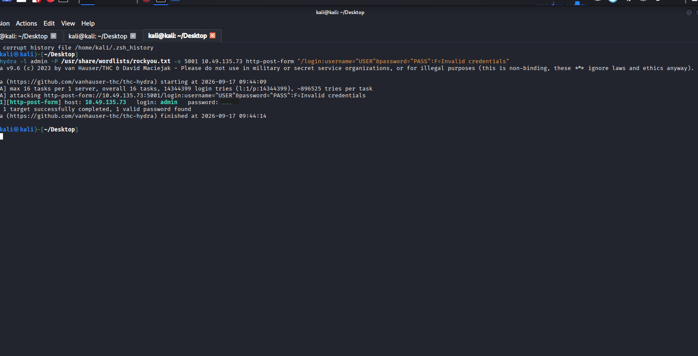
 
## Step 3 — Firewall Dashboard
After authentication, I reached the FirewallOS dashboard.
The dashboard exposed information such as:
- Firewall appliance name
- Management port
- WAN status
- Threat blocks
- IPS status
- Firewall policies
- System configuration information
  
 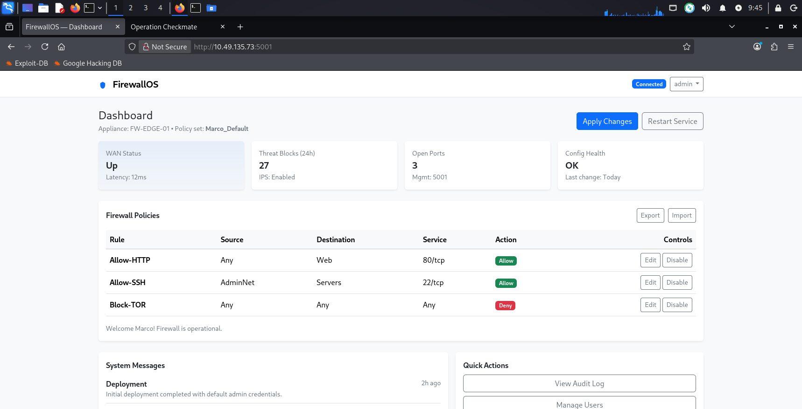
 
> **Finding:** The service was vulnerable because the administrator account was protected using a `default/weak credential`.

# Level 2 — Targeted Wordlist with CeWL
## Objective
The next clue pointed to:
```
jobs.thm:5002
```
It stated that Marco had created an internal employee login panel and used common company keywords as passwords.

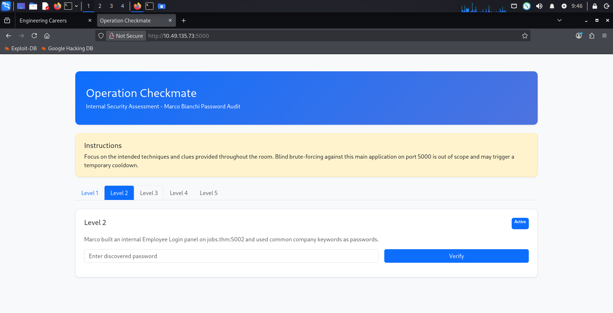

## Step 1 — Enumerating the Website
I accessed:
```
http://10.49.177.247:5002
```
The website was an Engineering Careers portal.

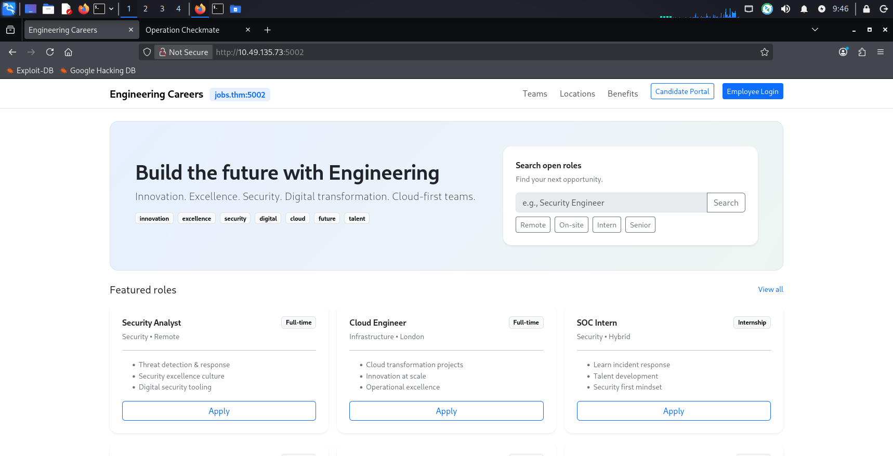
 
The website contained several useful keywords, including:
- innovation
- excellence
- security
- digital
- cloud
- future
- talent

These words were important because the challenge specifically mentioned company keywords.

## Step 2 — Employee Login

The website contained an Employee Login page.

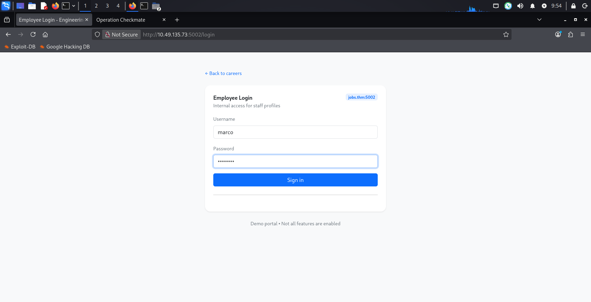
 
The username was:`marco`

Instead of blindly using a huge password list, I created a targeted wordlist from the website itself.

## Step 3 — Generate Wordlist with CeWL
I used CeWL to crawl the website and extract words.
```
cewl -d 2 -m 3 --lowercase --with-numbers \
-w 5002_words.txt \
http://10.49.177.247:5002
```
Options Used

| Option | Purpose
|---|---|
| -d 2	             | Crawl up to depth 2
| -m 3	             | Minimum word length of 3
| --lowercase	       | Convert extracted words to lowercase
| --with-numbers	   | Include words containing numbers
| -w	               | Save output to a wordlist

This produced:
```
5002_words.txt
```

## Step 4 — Attack the Login

I then used Hydra with the generated wordlist:
```
hydra -l marco \
-P 5002_words.txt \
-s 5002 \
TARGET_IP \
http-post-form \
"/login:username=^USER^&password=^PASS^:F=Invalid credentials"
```
Hydra successfully identified a valid credential.

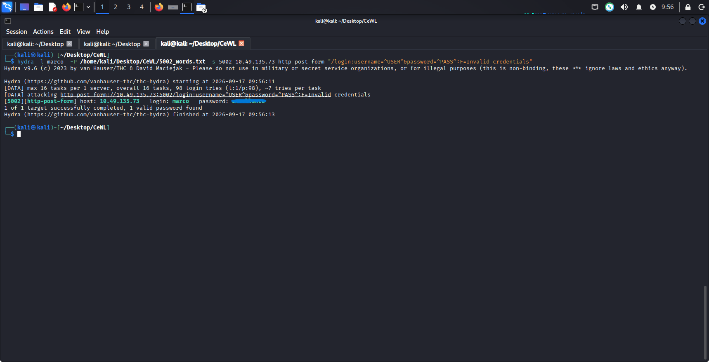
 
## Step 5 — Employee Profile
After successful authentication, I accessed Marco's employee profile.

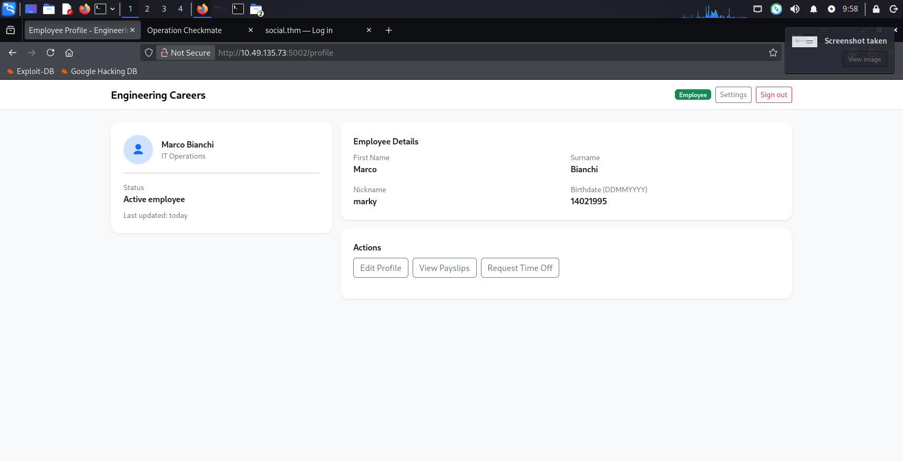 

The profile exposed additional information about Marco.
This information became useful in the next stage of the attack.

# Level 3 — Password Profiling with CUPP

## Objective
The Level 3 clue directed me to:
social.thm:5003

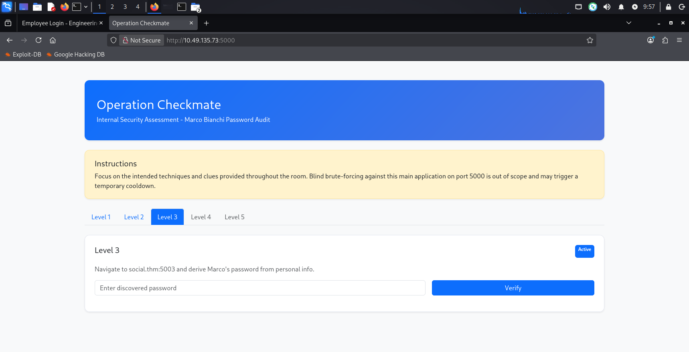

The login page contained a hint indicating that information from the employee portal could be used to generate Marco's password.

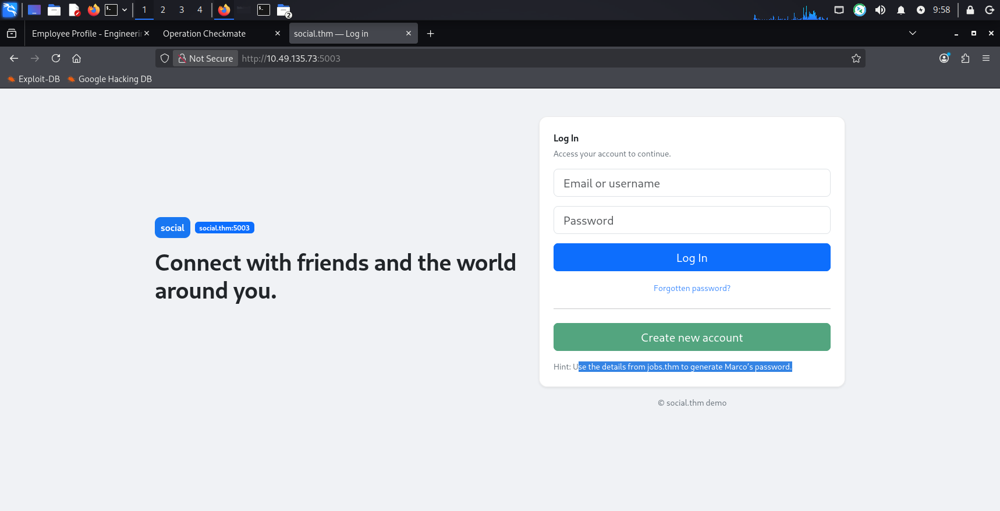

## Step 1 — Gather Information

From the employee profile, I collected publicly available information such as:
```
First Name: Marco
Surname: Bianchi
Nickname: marky
Birthdate: 14021995
```
I also found Marco's social media profile.
 
His public information provided useful clues about his password habits.

## Step 2 — Generate a Targeted Wordlist with CUPP
Instead of manually creating hundreds of combinations, I used CUPP — Common User Passwords Profiler.
```
python3 cupp.py -i
```
I entered the information discovered during enumeration:

- First Name: Marco
- Surname: Bianchi
- Nickname: marky
- Birthdate: 14021995

The remaining fields were left blank because they were not required.
CUPP generated:
`marco.txt`
containing combinations based on the supplied information.

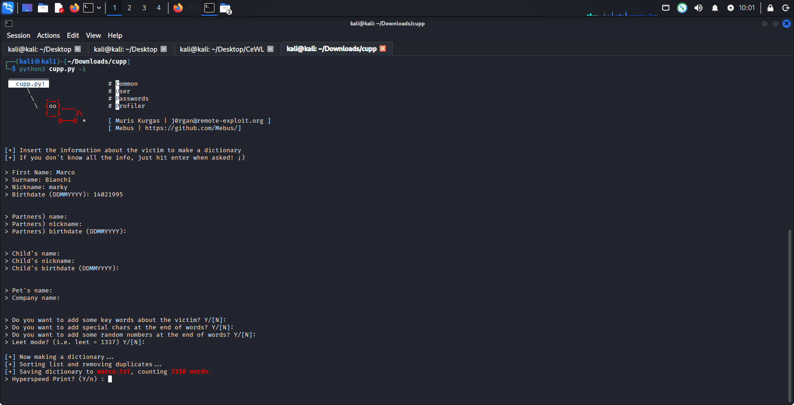

## Step 3 — Hydra Against the Social Login

I used the generated wordlist against the login form:
```
hydra -l marco \
-P marco.txt \
-s 5003 \
-f \
-t 4 \
social.thm \
http-post-form \
"/login:username=^USER^&password=^PASS^:F=invalid"
```
Important Options
- -l marco → target username
- -P marco.txt → CUPP-generated wordlist
- -s 5003 → target port
- -f → stop after finding a valid credential
- -t 4 → use four parallel tasks

Hydra successfully found a valid credential.

After authentication, I gained access to Marco's social media account.

# Level 4 — SHA-256 Filename Cracking
## Objective
The Level 4 clue revealed that Marco's uploaded profile picture had been renamed using the SHA-256 hash of the original filename.

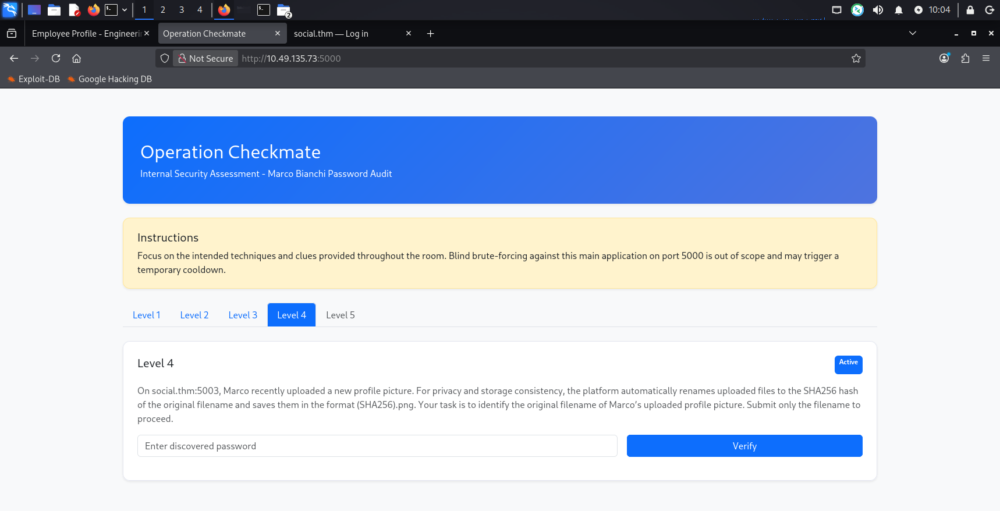

The resulting file was stored in the following format:
```
SHA256_HASH.png
```
The task was to recover the original filename.

## Step 1 — Identify the SHA-256 Hash
I opened Marco's profile picture in a new browser tab.

The image URL contained a long SHA-256 hash:
```
d34a569ab7aaa54dacd715ae64953455d86b768846cd0085ef4e9e7471489b7b
```
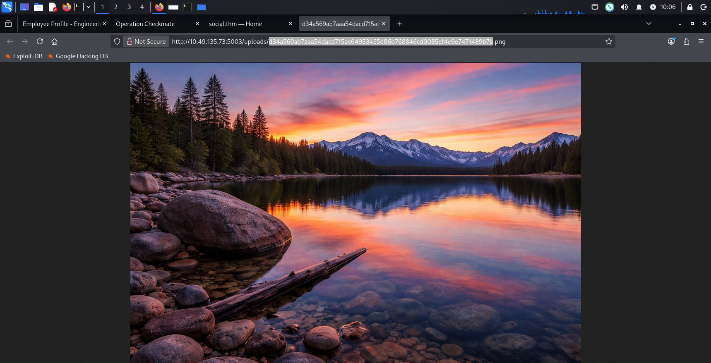

I extracted the hash and stored it in a file:
**hashh.txt**

## Step 2 — Crack the Hash with Hashcat

I identified the hash as SHA-256 and used Hashcat mode 1400.
```
hashcat -m 1400 \
-a 0 \
hashh.txt \
/usr/share/wordlists/rockyou.txt \
--session=sha256
```
| Hashcat | Options
|--|--|
| Option	| Meaning
| -m 1400	| SHA2-256 hash mode
|-a 0	| Straight/dictionary attack
| hashh.txt	| File containing the target hash
| rockyou.txt	| Dictionary
| --session=sha256	| Names the Hashcat session


Hashcat reported:
Status: Cracked
Hash.Mode: 1400 (SHA2-256)
 
The original filename was successfully recovered.

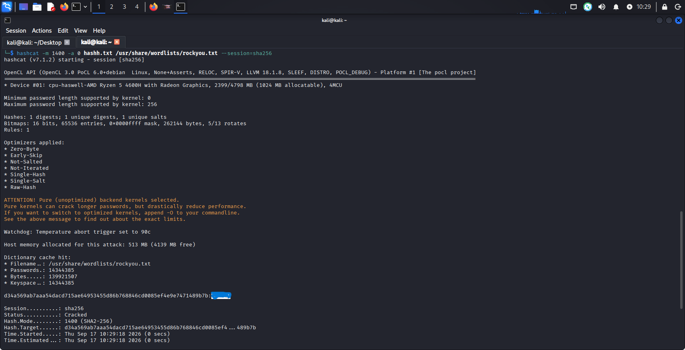


